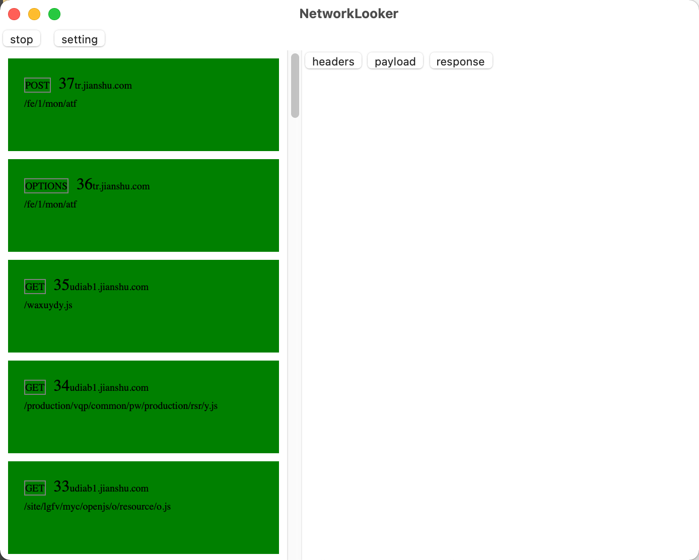

# NetworkLooker

# NetworkLooker 

**A cross-platform network debugging software**

An proxy server that accesses the Internet when the browser connects to NetworkLooker's proxy
You can monitor all data sent and received by the browser. It allows a developer to view all HTTP connections to the Internet
Letters, these include request, response and HTTP headers (includes cookies and caching information)




## Platforms

* Windows 
* [macOS](https://github.com/ericide/NetworkLooker/releases/tag/0.0.2)
* Linux
* Android
* iOS

## Features

* Capture packets for tls. Data can be re-signed
* Data can be jumped twice
* Data content can be overwritten

## Advantage

```Energy``` - ```efficient```, ```memory``` - ```saving tools```<br>

```comet```
```http proxy```
```sock5 proxy```
```http paser```
```record```
```transmit```
```sock5 client```
